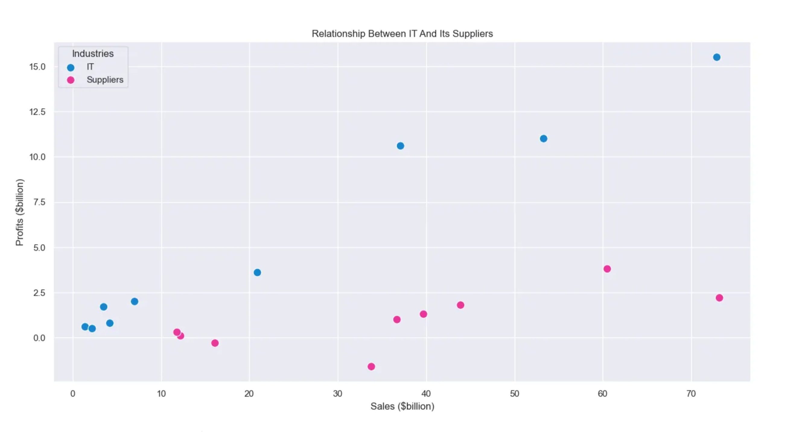

# New Product Launch Analysis

This project analyzes strategic approaches companies use when launching new products into competitive markets dominated by established players.

It merges insights from:
- **Forbes Best Employers 2023** (Kaggle)
- **Largest Companies in the World** (Data.World)

---

## Objective

The goal is to:
- Understand how many companies dominate each market
- Evaluate barriers to entry
- Analyze industry-supplier relationships
- Assess substitute product value and adaptation potential

---

## Sample Visuals

### Substitute Products Across Financial Metrics


### IT vs Suppliers: Sales & Profits


---

## Datasets Used

| Dataset | Source |
|--------|--------|
| `forbes_best_employers_2023.csv` | Kaggle |
| `Largest_Companies_In_The_World.csv` | Data.World |

---

## Key Features of the Analysis

- Merging and cleaning multi-source data
- Exploratory Data Analysis with `matplotlib` & `seaborn`
- Financial metrics visualization: sales, profits, assets
- Industry dominance and supplier comparisons
- Substitute product performance in Conglomerates

---

## Technologies Used

- Python 3.x
- pandas
- matplotlib
- seaborn

---

## How to Run

### 1. Install Dependencies
```bash
pip install -r requirements.txt
```

### 2. Run Script
Make sure CSV files are in a `data/` folder:
```bash
python main.py
```

---

## `requirements.txt`

```text
pandas
matplotlib
seaborn
```

---

## License

This project is opensource and it's available.

---

**Author**: Isaac Opoku

Email: ikeopoku@outlook.com

Portfolio: https://sites.google.com/view/isaac-opoku

Linkedin: https://www.linkedin.com/in/isaac-opoku-analytics-economics-specialist/

Medium: https://medium.com/@ikeopoku

  
[Read the full write-up on Medium](https://medium.com/@ikeopoku/understanding-the-market-new-product-launch-5d9990306be8)  


---
